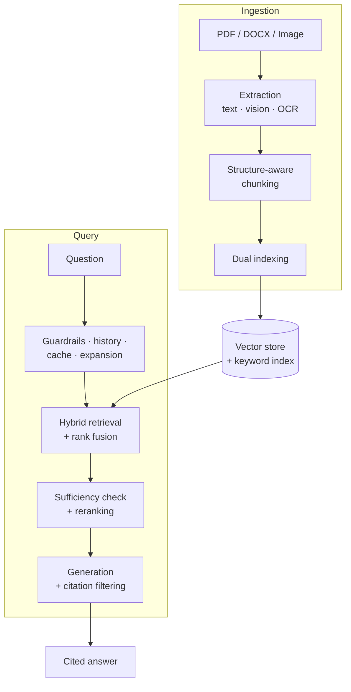

# Multimodal Hybrid-Retrieval RAG Framework

A Retrieval-Augmented Generation (RAG) system that ingests mixed-media documents (PDF, DOCX, and images) and answers natural-language questions with verifiable citations to their sources.

**Minor Project · 8 Weeks · 2 Members**

---

## Synopsis

Conventional RAG systems extract plain text from documents and retrieve it by semantic similarity. This works poorly on real documents, which carry a substantial share of their information in charts, tables, and figures: content that text extraction either loses entirely or flattens into unusable word sequences. Purely semantic retrieval also underperforms on queries containing exact identifiers, product codes, or rare proper nouns, where literal keyword matching is more reliable.

This project addresses both limitations. Documents are processed through a vision-language model that transcribes charts and tables into structured text, with an OCR path as fallback. Every resulting passage is indexed twice, as a dense embedding vector and as keyword-searchable text, and queries retrieve through both channels in parallel, with the two ranked lists merged by Reciprocal Rank Fusion.

Beyond building the system, the project treats two of its design choices as controlled experiments and reports quantitative results for each:

1. **Fusion weighting.** How the dense/sparse balance in rank fusion affects answer quality.
2. **Multimodal extraction.** Whether vision-model extraction measurably outperforms OCR-only extraction on documents containing tables and charts.

Both are evaluated against a hand-constructed question-answer set using the RAGAS metric suite.

---

## Documentation

| Document | Contents |
|---|---|
| [01. Project Overview](docs/01-project-overview.md) | Problem statement, objectives, scope, deliverables |
| [02. Requirements Specification](docs/02-requirements-specification.md) | Functional requirements, future scope, traceability |
| [03. System Architecture](docs/03-system-architecture.md) | Component design, pipeline diagrams, data model |
| [04. Technology Stack](docs/04-technology-stack.md) | Models, libraries, frameworks, and the justification for each |
| [05. Research Methodology](docs/05-research-methodology.md) | Experimental design, evaluation metrics, both ablation studies |
| [06. Implementation Plan](docs/06-implementation-plan.md) | Eight-week schedule, work distribution, risk assessment |
| [07. Design Decisions](docs/07-design-decisions.md) | Significant technical decisions with rationale |

---

## Objectives at a Glance

**Primary:** a working end-to-end pipeline that ingests a corpus of 20-50 mixed-media documents and answers questions with accurate citations.

**Research:** two controlled ablation studies producing quantitative results suitable for a written paper.

**Deliverables:** the working system, a research paper reporting both ablations, and a local demonstration.

---

## System Summary

Full diagrams and component descriptions: [03. System Architecture](docs/03-system-architecture.md).

---

## Technology Summary

| Layer | Choice |
|---|---|
| Language model | Google Gemini (Pro for generation, Flash for auxiliary tasks and vision) |
| Embeddings | Gemini `gemini-embedding-001` |
| Vector store | Chroma |
| Keyword index | BM25 (`rank_bm25`) |
| Reranker | Cross-encoder (`ms-marco-MiniLM-L-6-v2`, local) |
| OCR | PaddleOCR (PP-Structure for RQ2 baseline runs), Tesseract fallback |
| Backend | FastAPI + LangChain |
| Frontend | Next.js + Tailwind CSS |
| Evaluation | RAGAS |

Full stack with justification: [04. Technology Stack](docs/04-technology-stack.md).

---

## Team

| Member | Responsibility |
|---|---|
| **Member A** | Document ingestion pipeline, evaluation harness, multimodal extraction ablation |
| **Member B** | Query pipeline, web interface, fusion weighting ablation, research paper |

Both members collaborate on system integration and the final report. Detailed schedule: [06. Implementation Plan](docs/06-implementation-plan.md).
