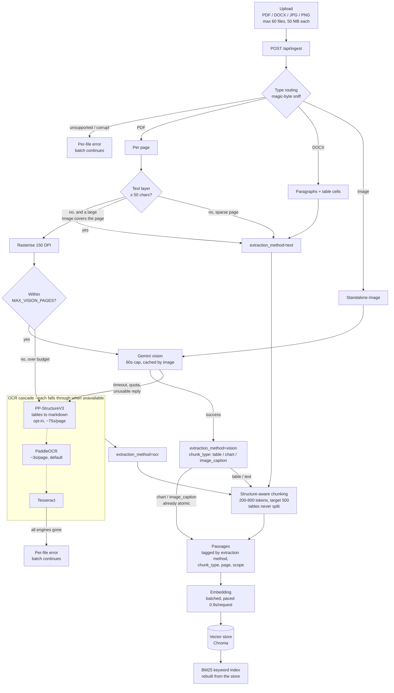
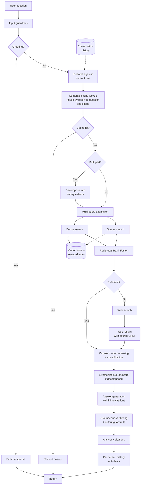
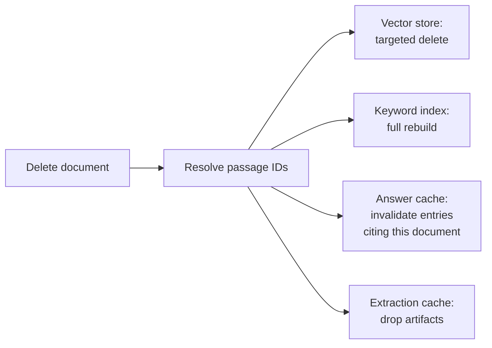

# 3. System Architecture

The system comprises two pipelines that share a single storage layer. The **ingestion pipeline** converts documents into indexed, searchable passages. The **query pipeline** converts a user question into a cited answer. The storage layer, a vector store and a keyword index over the same passages, is written by the first and read by the second. The passage schema that crosses this boundary is the formal interface between them.

---

## 3.1 Ingestion Pipeline



### Stage descriptions

**Type routing (INGEST-01).** Incoming files are classified by extension and verified against their magic bytes, since a collected corpus is likely to contain mislabelled files. Content-Type is deliberately not consulted: browsers derive it from the extension, so it is wrong in exactly the case the check exists to catch. Unsupported or unreadable files are skipped with a recorded per-file error and the remainder of the batch continues: a single malformed document must not abort ingestion of forty-nine valid ones. A file over the 50 MB limit is reported as too large rather than passed on as empty bytes, so the uploader is not told a document is corrupt when it is merely big.

**Text-layer extraction.** PDFs are processed page by page, preserving page numbers, which every corpus citation depends on. DOCX files yield both paragraph text and table-cell text; the latter is not present in the document's paragraph collection and must be walked separately.

**Scanned-document detection.** A PDF page qualifies for the image path on two conditions together: fewer than 50 extractable characters, and a placed raster image covering a large fraction of the page. Both are required because a genuinely sparse page (a section divider, a mostly blank form page) has little text but nothing to look at, and rendering it would spend a vision call transcribing whitespace; its text stands as-is. A qualifying page is rasterised at 150 DPI and goes to vision, not straight to OCR. The decision is made per page rather than per document, since documents mixing digital and scanned pages are common.

**Vision extraction (INGEST-02).** Page images and standalone images are submitted to a vision-language model with a prompt requesting structured output: tables transcribed as markdown preserving row and column relationships, and charts described by type, axes, and readable data points. An unstructured prose description is of little retrieval value; the structure is what makes a table's contents matchable against a question. The model classifies its own output, and that classification becomes the passage's `chunk_type` (`table`, `chart`, or `image_caption`). Charts and captions are already short and self-contained, so they bypass chunking and become one passage directly.

Two limits bound this stage. Each request is capped at 60 seconds with no SDK-internal retry: long enough for a real transcription, measured at roughly 15 to 30 seconds per figure, while still failing over to OCR rather than stalling a batch. Responses are cached by image content, so re-ingesting a document does not pay for its figures twice. A throttled key is a separate matter, handled by rotation rather than by the timeout: the API reports a rate limit immediately, and the request is retried against the next key in the pool with exponential backoff.

**Vision budget.** `MAX_VISION_PAGES` bounds how many pages of one document reach the model. Pages beyond it fall through to OCR instead of failing the document, so a several-hundred-page scan yields a fully indexed document of mixed extraction quality rather than nothing at all. The budget bounds spend, not how much of a document is read.

**OCR fallback (D-27).** When vision extraction fails, times out, returns nothing usable, or the page is over the vision budget, the passage is produced by OCR instead. Three engines form a cascade, each falling through to the next when it is unavailable, and every fallback is logged with its cause:

| Engine | Cost per page | Role |
| --- | --- | --- |
| PP-StructureV3 | ~75s (CPU) | Layout analysis and table structure recognition. Tables are returned as markdown, so a recovered table keeps its rows and columns rather than being flattened to reading order. This is RQ2's structure-aware baseline. |
| PaddleOCR | ~3s | Plain text recognition in reading order. The default. |
| Tesseract | ~1s | Last resort, so an unavailable paddle does not cost the page entirely. |

The engine is selected by `OCR_ENGINE`, and the default is plain PaddleOCR rather than PP-Structure. This is a deliberate departure from always taking the most capable engine: at roughly 75 seconds per page, structure recognition over the full corpus takes hours, and measurement shows the cost is model-bound rather than resolution-bound, so it cannot be tuned away by rendering smaller pages. PP-Structure is therefore enabled for the RQ2 baseline runs that need recovered tables and left off for ordinary ingestion. A page is lost only when every engine is unavailable, which is reported as a per-file error.

Note that in normal operation this path runs rarely. Vision handles figures and scanned pages, so OCR is genuinely a fallback: a corpus ingested with a healthy vision path produces few or no `ocr` passages.

**Structure-aware chunking (INGEST-03).** Passages target 500 tokens and are bounded at 200 and 800 (`CHUNK_TARGET_TOKENS`, `CHUNK_MIN_TOKENS`, `CHUNK_MAX_TOKENS`), measured with a tiktoken `cl100k_base` length function. Splits fall on structural boundaries (headings, paragraph breaks, table blocks) in preference to fixed offsets. A run of two or more consecutive markdown table rows is detected as a table and emitted whole as a `chunk_type="table"` passage even when it exceeds the maximum: an oversized intact table is more useful than two fragments of one. This is why the OCR path converts recovered tables to markdown pipe syntax rather than leaving them as HTML, and it is what connects table structure recognition to anything downstream. The nearest preceding markdown heading is carried into each passage's `location` field, which materially improves retrieval on structured documents.

**Dual indexing (INGEST-04).** Passages are embedded in batches, and each batch is written to the vector store as soon as it succeeds, so a failure partway through a long document does not discard the passages already embedded. Embedding requests are paced, because the embedding API issues one request per text rather than a true batch call, which would otherwise breach the free-tier ceiling. The BM25 keyword index is then rebuilt once from the vector store. Deriving it from the store rather than writing both in parallel is what makes the two indexes share one identifier per passage by construction: the keyword index cannot drift from the store it is built from. One passage, two indexes, one identifier.

---

## 3.2 Query Pipeline



### Stage descriptions

**Input guardrails (QUERY-13).** Two tiers. Deterministic checks run first: length bounds, control-character stripping, and known injection patterns. A model-based classification runs only if the deterministic tier passes, so that no API call is spent rejecting an empty string.

**Greeting short-circuit (QUERY-01).** Short conversational inputs are answered directly without retrieval. The classifier is deliberately biased towards passing input through: incorrectly short-circuiting a genuine question is a far worse failure than unnecessarily retrieving for a greeting.

**Conversational resolution (QUERY-15).** A follow-up question is rewritten into a self-contained form against the last 2-3 turns before any downstream stage sees it. "Why did it decline?" becomes "Why did Acme's Q3 revenue decline?". This stage is placed early by necessity, because retrieval, expansion, decomposition, and caching are all incapable of handling an unresolved pronoun. Questions that are already self-contained pass through unmodified.

**Semantic cache (QUERY-02).** The resolved question is embedded and matched against previously answered questions by vector similarity, so a paraphrase of an earlier question returns its stored answer. The similarity threshold is set conservatively: because a cache hit bypasses the entire pipeline, an over-permissive threshold returns a confident answer to a question that was never actually asked, with no downstream stage able to catch it. Cache entries are keyed by document scope as well as question, and record which documents their answer cited.

**Decomposition (QUERY-12).** Compound questions are split into 2-4 sub-questions, each retrieved independently. Detection is biased against decomposing, since an unnecessary decomposition multiplies retrieval cost and can produce a worse answer than a single well-targeted pass.

**Multi-query expansion (QUERY-03).** The question is reformulated into 3-5 semantic variants to improve recall. Variants are prompted to differ meaningfully (a more specific phrasing, a more general one, alternative terminology) rather than cosmetically.

**Hybrid retrieval (QUERY-04).** Expanded queries drive dense vector search; the resolved question drives sparse keyword search. The asymmetry is deliberate: expansions improve semantic recall, whereas BM25 performs better against the user's actual terms than against model-generated paraphrases. Both searches execute concurrently and both are filtered by document scope.

**Reciprocal Rank Fusion (QUERY-05).** The two ranked lists are merged by rank position rather than by score, since cosine similarity and BM25 scores are not on comparable scales. The relative weight of the dense and sparse contributions is a configuration parameter, and is the variable manipulated in RQ1.

**Sufficiency assessment (QUERY-06).** Fused results are assessed for whether they can actually answer the question, combining a cheap signal (top-k score magnitude) with a model judgment over the candidate passages.

**Web fallback (QUERY-07).** When retrieval is assessed as insufficient, a web search supplies supplementary context. Web results carry a source URL rather than a document and page, and this distinction propagates through to the citations presented to the user.

**Reranking (QUERY-08).** A cross-encoder scores each candidate against the original question directly. This is more accurate but more expensive than the bi-encoder similarity used at retrieval time, which is why it is applied to a shortlist rather than the full corpus. The top candidates are consolidated into a context set within a fixed token budget.

**Generation (QUERY-09).** The generation model receives numbered context passages, each labelled with its source identity, and is instructed to answer only from that context, to state plainly when the context is insufficient, and to cite inline.

**Groundedness filtering and output guardrails (QUERY-10, QUERY-14).** Two distinct checks. The first verifies that every citation marker resolves to a real passage and that each cited passage genuinely supports the claim attached to it. The second checks the answer for safety and quality independent of grounding. Unsupported claims are removed; if nothing survives, the system reports honestly that the retrieved context does not answer the question.

**Write-back (QUERY-11).** Answers that pass both checks are written to the semantic cache and appended to conversation history. Rejected answers are never cached, because a cached failure would be served instantly and confidently on every subsequent match.

---

## 3.3 Document Deletion

Deletion (USERDOC-02) must reach four locations. The keyword index is the one most easily overlooked.



The BM25 implementation maintains its own in-memory copy of passage text and provides no delete operation. A document removed from the vector store therefore remains fully searchable through the sparse retrieval path, and can still be retrieved, reranked, and quoted into a generated answer, until the keyword index is rebuilt. At this corpus size a complete rebuild is effectively instantaneous, so no incremental approach is warranted.

---

## 3.4 Data Model

The passage schema is the interface contract between the ingestion and query pipelines, owned by different team members. Once implementation begins it is treated as a fixed interface requiring mutual agreement to change.

| Field | Type | Purpose |
|---|---|---|
| `chunk_id` | string | Stable unique identifier |
| `text` | string | Passage content |
| `source_doc` | string | Originating document |
| `page` | integer or null | Page number where applicable |
| `location` | string or null | Positional hint: section heading or image index |
| `chunk_type` | enum | `text`, `table`, `chart`, `image_caption` |
| `extraction_method` | enum | `vision`, `ocr`, `text` |
| `corpus_scope` | string | `persistent` or `session:{id}` |
| `dense_vector_id` | string or null | Vector store reference |
| `embedding_model` | string or null | Model that produced the vector |

Two fields exist for reasons beyond ordinary operation:

**`extraction_method`** records how each passage's content was obtained. RQ2 compares vision-based against OCR-based extraction, and this field is what makes the comparison possible. It must be recorded accurately from the first ingestion run onwards, including on fallback paths. A passage produced by OCR fallback but labelled as vision-extracted would silently corrupt the experiment's headline result.

**`corpus_scope`** separates the persistent corpus from ad-hoc session uploads within a single store, supporting USERDOC-01 without maintaining parallel infrastructure.

### Citation model

Citations are modelled as a discriminated union, because corpus-sourced and web-sourced results have genuinely different identity:

- **Corpus citation:** document, page, passage identifier.
- **Web citation:** source URL, page title.

Both the groundedness filter and the user interface branch on this distinction, so it is represented structurally rather than by null-checking absent fields.

---

## 3.5 Repository Structure

```
backend/
  app/
    main.py              Application factory
    core/                Configuration, API key rotation, Gemini client
    api/routes/          HTTP endpoints
    ingestion/
      router.py          Type routing by magic bytes
      extractors/        pdf, docx, image, vision, ocr, paddle_ocr
      splitter.py        Structure-aware chunking
      embedder.py        Batched, paced embedding
      indexer.py         Vector store + keyword index writes
      pipeline.py        Stage orchestration, per-file error isolation
    query/               Guardrails, retrieval, fusion, generation
    shared/              Passage schema, vector store, keyword index
  tests/
frontend/                Next.js application
eval/                    Evaluation harness, QA set, ablation scripts
data/corpus/             Document corpus and manifest
```

The `shared/` package holds everything both pipelines depend on. The division between `ingestion/` and `query/` mirrors the division of work between team members, allowing the two halves to be developed and tested independently against the passage schema.

---

## 3.6 Cross-Cutting Concerns

**API key rotation.** Free-tier rate limits are the binding operational constraint. A rotation utility round-robins across a pool of keys per provider, and every outbound API call passes through it. It is built in the first week, since retrofitting it after the pipeline exists would require modifying every call site.

**Caching.** Three caches address distinct problems: an embedding cache keyed by content hash, avoiding thousands of redundant calls when the evaluation suite re-runs the same questions across ablation settings; an extraction cache, so that re-ingestion during development does not re-pay the heaviest ingestion cost; and the semantic answer cache, which is a user-facing feature rather than an optimisation. The answer cache is explicitly bypassed during evaluation runs, since a cache hit would return a previous configuration's answer and silently invalidate the comparison.

**Observability.** Pipeline progress and resource consumption are surfaced through a single mechanism. Each stage emits a structured event through an injected emitter, which the streaming endpoint forwards to the client in Server-Sent Events format over a POST request. The pipeline itself remains unaware of the transport, and a no-op emitter is substituted for non-streaming calls such as the evaluation harness. The same event stream carries token usage, recorded inside the provider-client wrapper that also performs credential rotation. Binding both concerns to one wrapper means a call bypassing it bypasses both, which is straightforward to detect in review. Recording usage at individual call sites would instead miss some calls and produce silently incorrect totals. Per-stage timing is captured by the same mechanism at no additional cost, and is reported alongside quality metrics in the evaluation.

**Latency.** Implemented naively, the query pipeline is a sequence of eight model calls. Four measures keep it usable: deterministic checks gate every model call so that clean input skips avoidable ones; the two post-generation checks share a single call while remaining separately reported; the fast model handles every task except final generation; and pipeline-stage progress is streamed to the interface so that waiting time is legible rather than blank.
